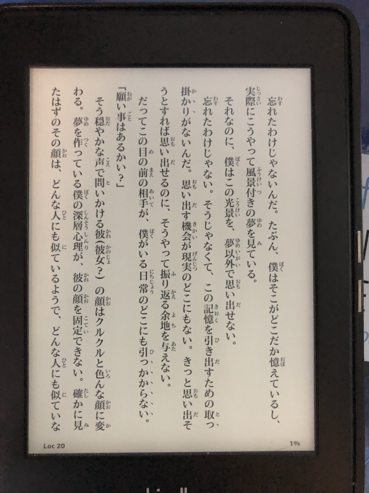

# furiganalize-epub

> japanese is hard lol -- Aaron

Japanese pronounciation of Kanji is hard. The meaning and writing of Kanji is easy (because I speak Chinese at a native level lol). To save me from looking up the pronounciation of every other word in a Japanese light novel and failing *every* **single** *time* because I have fat thumbs, and the Kindle Paperwhite isn't great at handling lookup selections, I hacked this thing that takes in a epub book, looks up Kanji pronounciations and tries to backpatch furigana onto the existing Kanji text.

If you're here, you're probably also looking to cut down the number of pronounciation lookups. Or you're the type that just likes to read around Kanji text.

# Disclaimer

I wrote this in literally less than a day. And that includes writing an ad-hoc xml parser, utf8 conversions, some arbitrary kana/kanji colocation matching and fiddling with unix processes. This means that there are a lot of cases that I didn't/won't handle, since I'm assuming that most sane people who write japanese epub books use a very specific subset of XHTML, and format their ebook content in `<p>` tags like every other sane person. Also I'm not even close to being proficient in japanese, so the ad-hoc kana matching algorithm I wrote could run into kanji colocation issues.

Also, note that mecab isn't the best at guessing Japanese pronounciation, due to the sheer amount of special cases in the language. One of the most prominent cases is that mecab thinks `そんな風に` is prounounced `そんなかぜに` rather than `そんなふうに`. Use it with a grain of salt, and when in doubt just look up the pronounciation in the dictionary.

# Setup

You will need:
  - MLton compiler (http://www.mlton.org/, or generally just from your favorite package manager.)
  - MeCab (http://taku910.github.io/mecab/#download)
  - MeCab IPA Dictionary (http://taku910.github.io/mecab/#download)
  - `zip`, `unzip`, make sure they are accessible from path. If you don't want to use these edit `src/configure.sml` and use some other zip/unzip util there.

Note that `mecab`, `zip`, and `unzip` needs to be accessible from path (or change `src/configure.sml` if you don't like that). This utility relies on running child processes for file handling purposes.
### Setup for MeCab

Unzip MeCab source, and build (in MeCab source directory):
```sh
$ ./configure
$ make
$ sudo make install
```

### Setup for MeCab IPA

Unzip MeCab IPA source, and build (in MeCab IPS source directory):
```sh
$ ./configure --with-charset=utf8 --enable-utf8-only
$ make
$ sudo make install
```

Note that if you're using a Debian based system you may run into odd linking issues due to how it sets `LD_LIBRARY_PATH`. There are many ways to fix that, but basically google is your friend.

Run `mecab`, type in a full Japanese sentence, press Enter, make sure that it actually works. That will save you a lot of trouble down the road.

### mlton build (recommended)

Clone the repo, and build:
```sh
$ make mlton
```

The built binary shows up in `bin/furiganalize`.

### smlnj build (borked?)

(Note: this doesn't work for me for god knows what reason, NJ heap fails to load with "incorrect byte order in heap image".
I'm on v110.79, so maybe newer versions will have better luck.)

```sh
$ make smlnj
```

Note that this creates a dummy binary in `bin/furiganalize` with a heap right next to it, as usual.

# Run

```sh
$ ./bin/furiganalize book.epub
```

This creates a backup for `book.epub` named as `book_bkp_<timestamp>.epub`, and overwrites `book.epub` with content annotated with furigana. If you don't want to make a backup just pass in `-d`.

If you use a Kindle Paperwhite like me, I would recommend running [kindlegen](https://www.amazon.com/gp/feature.html?ie=UTF8&docId=1000765211) on the output to convert to Kindle compatible mobi,
and use the email "Send to Kindle", since apparently Amazon's service also does some word boundary detection.

# License
Apache License 2.0

# Shitposting?
Yes?


